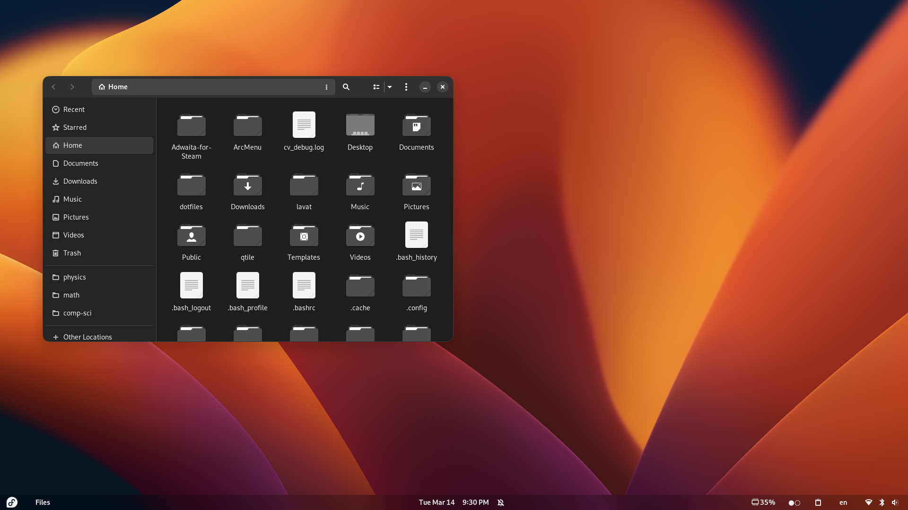

# my-fedora-rice
Default GNOME but tweaked a bit to my taste

## Settings:
### Date & Time:
Time format: AM/PM (a.k.a 12-hour format)

### Appearance: 
Dark

### Notifications: 
Lock Screen Notifications: OFF

### Privacy:
#### Screen: 
- Blank Screen Delay: 15 minutes
- Automatic Screen Lock: ON
- Automatic Screen Lock Delay: Screen Turns Off
- Lock Screen Notifications: OFF

#### File History & Trash:
- File History: ON
- File History Duration: 7 days
- Automatically Delete Trash Content: ON
- Automatically Delete Temporary Files: ON
- Automatically Delete Period: 30 days

### Power:
- Power Mode: Performance
- Screen Blank: 15 minutes
- Automatic suspend: ON
- Power Button Behavior: Suspend

### Keyboard:
#### Input sources: 
- English (US) 
- Mongolian

#### Shortcuts:
Launchers:
- Launch web browser: Super+B

Navigation:
- Move to workspace on the left: Ctrl+Super+Left
- Move to workspace on the right: Ctrl+Super+Right
- Move window one workspace to the left: Shift+Super+left
- Move window one workspace to the right: Shift+Super+right
- Move window to workspace 1: Shift+Super+1
- Move window to workspace 1: Shift+Super+2
- Move window to workspace 1: Shift+Super+3
- Move window to workspace 1: Shift+Super+4
- Switch to workspace 1: Super+1
- Switch to workspace 1: Super+2
- Switch to workspace 1: Super+3
- Switch to workspace 1: Super+4
- Switch windows: Alt+Tab

Screenshots:
- Take a screenshot: Super+S
- Take a screenshot interactively: Shift+Super+S

Sound and Media:
- Next track: Audio next
- Play (or play/pause): Audio play
- Previous track: Audio previous
- Volume down: Audio lower volume
- Volume mute/unmute: Audio mute
- Volume up: Audio raise volume

System:
- Show all applications: LaunchB
- Show the overview: LaunchA
- Show the run command prompt: Super+R

Windows:
- Close window: Super+Q
- Hide window: Super+N
- Toggle fullscreen mode: Shift+Super+M
- Toggle maximization state: Super+M

Custom Shortcuts:
- Open Console (kgx): Super+Return
- Open Files (nautilus): Super+F

### Default Applications:
- Web: Microsoft Edge

## Must install:
### GNOME Tweaks:
#### Appearance:
- Cursor: Adwaita (default)
- Icons: Tela-black
- Shell: Custom-Accent-Colors (from the extension "Custom Accent Colors")
- Legacy Applications: Adw-gtk3-dark

#### Fonts: 
- Fedora defaults (Cantarell Regular)

#### Keyboard & Mouse:
- Acceleration profile: Flat
- Middle click paste: OFF

#### Top Bar:
- Clock Weekday: ON

#### Window Titlebars:
- Minimize: ON
- Placement: Right

#### Windows:
Resize with secondary-click: ON

### VS Code:
Monokai Orange theme

### Obsidian:
Adwaita theme

### Microsoft Edge:
#### PWAs:
- YouTube
- Instagram
- MS To-Do
- Notion

### OBS Studio
### VLC Media Player
### Cool Retro Term (dope terminal emulator):
- retro-term.json
### Kitty (super minimal terminal emulator):
- Gruvbox theme
### Steam:
- Adwaita theme
### Discord
### GNOME Console
### HPLIP (for using HP printers)
### Cider (Apple Music client)
### EasyEffects

## GNOME Shell extensions and configurations:
### Blur my Shell:
#### General:
- Sigma: 30
- Brightness" 0.78
- Color: #000000
- Noise amount: 0
- Noise lightness: 0
- Color and noise effects: OFF

#### Panel:
- Customize properties: OFF
- Static blur: ON
- Disable in overview: ON
- Override Background: ON
- Background style: Transparent
- Disable when a window is near: OFF
- Hidetopbar extension: OFF

### Clipboard Indicator
### Custom Accent Colors:
- Accent Color: Orange
- Flatpack Theming: ON
- GTK3 Theming: ON
- Shell Theming: ON

### Custom Hot Corners - Extended
#### Top left: 
- Show Activities Overview

#### Top right:
- Left-click: Close Window
- Right-click: Minimize Window
- Middle-click: Fullscreen Window (toggle)
- Scroll up: Previous Workspace
- Scroll down: Next Workspace

#### Bottom Right:
- Right-click: Show Desktop 

### GTK Title bar:
- Hide When: Maximized
### Just Perfection:
#### Visibility:
- Activities Button: OFF
- World Clock (in clock menu): OFF
- Weather (in clock menu): OFF
- Events (in clock menu): OFF

#### Icons:
- App Menu Icon: OFF
- Panel Notification Icon: ON
- Power Icon: OFF

#### Behavior:
- Workspace wraparound: OFF
- Window Demands Attention Focus: OFF
- Double Super to App Grid
- Startup Status: Desktop

#### Customize:
- Panel Position: Bottom
- Animation: Faster
- Dash Icon Size: 40px

### Lock Keys:
- Indication Style: Show/Hide
- Notifications: Osd

### Logo Menu:
- Icon: Fedora
- Icon Size: 25px
- Enable Power Options: ON
- Hide Force Quit option: ON
- Show Lock Screen option: ON
- Hide Software Center option: ON
- Terminal: kgx

### No Titlebar When Maximized
### Rounded Window Corners:
- Skip LibAdwaita Applications: OFF
- Skip LibHandy Applications: OFF
- Border Width: 1.0
- Border Color: #3A3A3A
- Border Radius: 13.0
- Corner Smoothing: 0.1

### Scroll Panel
### User Themes
### Vitals:
- Position in panel: Right
- Seconds between updates: 3
- Use fixed widths: ON
- Only "Monitor memory": ON

### Workspace Indicator
